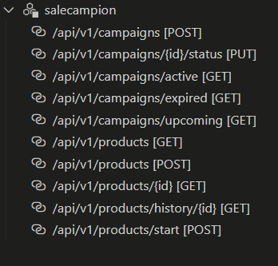
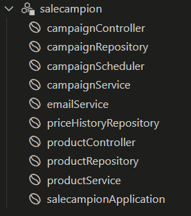

## 📚 API

### Campaign Endpoints

- `GET /api/v1/campaigns/active` - Retrieve active campaigns.
- `GET /api/v1/campaigns/expired` - Retrieve expired campaigns.
- `GET /api/v1/campaigns/upcoming` - Retrieve upcoming campaigns.
- `POST /api/v1/campaigns` - Create a new campaign.
- `PUT /api/v1/campaigns/{id}/status` - Update campaign status.

### Product Endpoints

- `GET /api/v1/products` - Fetch paginated product data.
- `GET /api/v1/products/{id}` - Get product details by ID.
- `POST /api/v1/products` - Add multiple products.
- `GET /api/v1/products/history/{id}` - Retrieve product price history.

### BEANS
